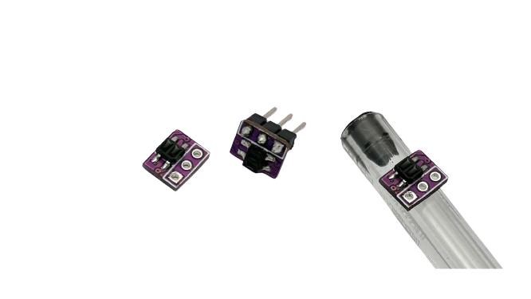

# FXDevices - Dispositivos para Robótica e Automação

Este repositório contém exemplos e documentação dos dispositivos da Fox Dynamics, projetados para robótica educacional, competições e automação. Cada seção apresenta detalhes técnicos, exemplos de código, esquemáticos e instruções para uso dos dispositivos. Este repositório serve como um ponto de referência para desenvolvedores, estudantes e entusiastas que trabalham com sistemas embarcados e eletrônicos voltados para automação e controle.
<!--Sensores, modulos e placas controladoras da Fox Dynamics.-->

<!--
## Índice

- [Dispositivo 1: Sensor Mini Sumo](#Dispositivo-1:-Sensor-Mini-Sumo)
- [Dispositivo 2: Módulo Start](#Dispositivo-2:-Módulo-Start)
- [Dispositivo 3: Sensor de Linha Mini Sumo](#Dispositivo-3:-Sensor-de-linha-mini-sumo)
- [Dispositivo 4: ESC 2 motores Brushed](#Dispositivo-4:-ESC-2-motores-Brushed)
---
-->

# Sensores

## Sensor FX-S50

[Saiba mais sobre](./Sensor_FXS50/README.md)

Sensor digital de oponentes compacto e rápido, ideal para detectar oponentes em competições de mini ou micro sumô. Além de uma saída digital simples para detecção imediata, ele possui um pino para configuração e leitura que permite a conexão com até 32 sensores usando apenas um único fio, facilitando a integração e o controle em robôs que utilizam muitos sensores.

Além disso, o sensor possui um modo "Shell", que possibilita conectá-lo a um computador através de um conversor USB-Serial. Esse modo permite a leitura de dados e a configuração detalhada dos parâmetros diretamente pelo terminal.

**Video demonstrativo:** ...  

| Característica         | Valor                 |
|------------------------|-----------------------|
| Tipo de sensor         | Obstaculos digital     |
| Faixa de medição       | 5 a 45cm (*)  |
| Tensão de operação     | 3,3 a 5V      |
| Corrente de operação   | 12 a 16mA     |
| Interface de comunicação | saida digital e Pino Fox Wire |
| Dimensões                | 11,4 x 12,4 x 16,2 mm    |
| Peso        | 4,9 g  |

---

## Sensor de Linha Mini

[Saiba mais sobre](./Sensor_linha/README.md)

Pequeno sensor de linha ideal para robôs de Sumô 3kg, Mini, micro ou nano ou em seguidores de linha, principalmente como sensor de marcação lateral.

| Característica         | Valor                 |
|------------------------|-----------------------|
| Tipo de sensor         | sensor de linha analogico  |
| Tensão de operação     | 3,3 a 5V      |
| Dimensões                | 8 x 6,5 x 3,3 mm    |
| Peso        | 0,15 g  |

---

## Sensor digital TOF
Em breve...

## Módulo Start
Em breve...

# ESCs

| ESCs     | Tipo |  Motores | Tensão | Corrente Maxima | sensor |
|---|---|---|---|---|---|
| FX-M1 LP | brushed | 1 | 2S | 1,5A | sim |
| FX-M1 HP | brushed | 1 | 2 a 4S | 3A | sim |
| FX-M2 LP | brushed | 2 | 2S | 1,5A | sim |
| FX-M2 HP | brushed | 1 | 2 a 4S | 3A | sim |
| FX-M1 UHP | brushed | 1 | 2 a 6S | 40A | sim |  
  
# Placas Controladoras

| Controladora | Microcontrolador | Tensão | USB | Radio |  Motores | Sensores | Aplicação |
|---|---|---|---|---|---|---|---|
| Fox Nano War  | - | 2S | Não | FlySky | 2 Brushed 1,5A | Medição de bateria e IMU (opcional) | Combate Fada ou Ant |
| Fox Nano  | Atmega328 | 2S | Não | Não possui | 2 Brushed 1,5A | Medição de bateria, 5 entradas, receptor IR (opcinal) e IMU (opcional) | Combate Fada ou Ant |
| Fox Nano W | ESP32-C3 | 2S | Não | WIFI, BLE ou ESPNOW | 2 Brushed 1,5A | Medição de bateria, 4 entradas, receptor IR (opcinal) e IMU (opcional) | Combate Fada ou Ant e Mini ou Micro Sumo |
| Fox Mini | Atmega328 | 2S a 4S | Sim | Não possui | 2 Brushed 3A | Medição de bateria, 8 entradas, receptor IR e IMU (opcional) | Combate Ant ou Beeatle e Mini Sumo e Seguidor |
| Fox Mini W | ESP32 | 2S a 4S | Sim | WIFI, BLE ou ESPNOW | 2 Brushed 3A | Medição de bateria, 10 entradas, receptor IR e IMU (opcional) | Combate Ant ou Beeatle e Mini Sumo e Seguidor |

# Outras placas

## Conversor Rádio ESPNOW

Conecte este módulo a saida "trainer" PPM de um radio para torna-lo compativel com transmissão ESPNOW.

em breve...

---   

  

<!--- [Alt text](LogoFox.png) -->