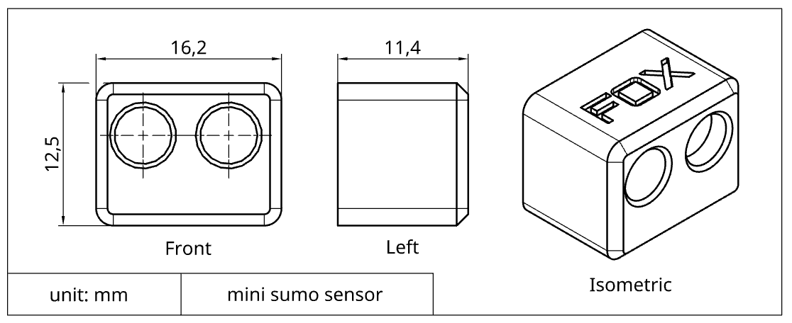
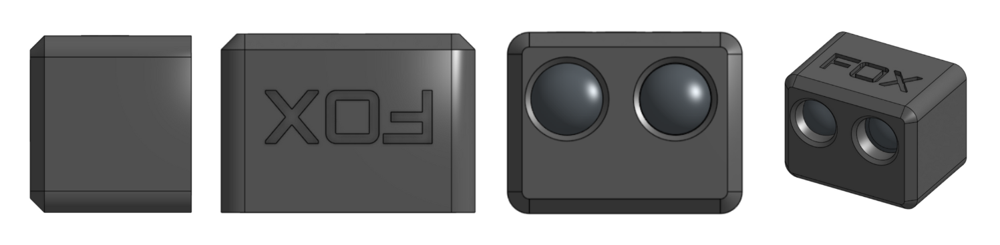
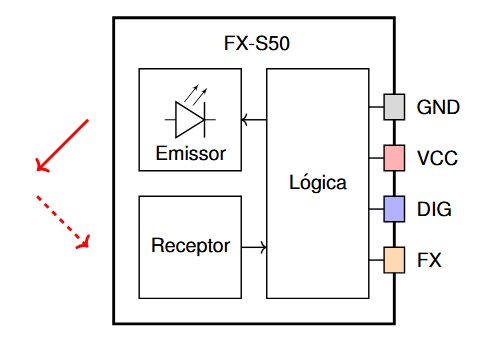
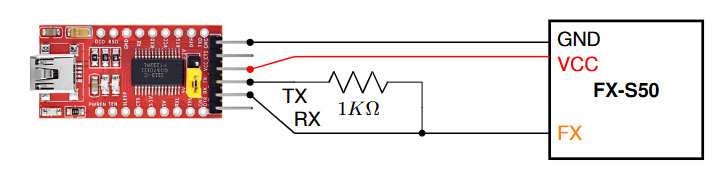

# Sensor FX-S50

Sensor digital de oponentes compacto e rápido, ideal para detectar oponentes em competições de mini ou micro sumô. Além de uma saída digital simples para detecção imediata, ele possui um pino para configuração e leitura que permite a conexão com até 32 sensores usando apenas um único fio, facilitando a integração e o controle em robôs que utilizam muitos sensores.

Além disso, o sensor possui um modo "Shell", que possibilita conectá-lo a um computador através de um conversor USB-Serial. Esse modo permite a leitura de dados e a configuração detalhada dos parâmetros diretamente pelo terminal.


**Video demonstrativo:** [https://www.youtube.com/watch?v=7ljwJTxrwXw](https://www.youtube.com/watch?v=7ljwJTxrwXw) 

## Características Técnicas

| Característica         | Valor                 |
|------------------------|-----------------------|
| Tipo de sensor         | Obstaculos digital ajustavel    |
| Faixa de medição       | 0 a 50cm (*)  |
| Tensão de operação     | 3,3 a 5V      |
| Corrente de operação   | 12 a 16mA     |
| Interface de comunicação | Saida digital e pino Fox Wire |
| Dimensões                | 11,4 x 12,4 x 16,2 mm    |
| Peso        | 4,9 g  |

(*) Medição na configuração padrão. Em testes, chegou a alcançar até 70cm na configuração mais sensivel. Os resultados podem variar em função da cor, inclinação e tamanho do objeto detectado. Ajuste a sensibilidade em função da aplicação.






### Modelo 3D

[Modelo 3D STEP](./SensorMini_3dmodel.step)

## Comparação com outros sensores


## Pinagem

- Pino GND
- Pino Vcc (Alimentação de 3,3V a 5V)
- Pino S de saida digital ( HIGH detectado, LOW não detectado )
- Pino Fox Wire (Configuração e leitura)



## Configuração do sensor

Este sensor é configuravel, a tabela abaixo apresenta os principais parâmetros.

| Parametros          | Descrição                 |
|---------------------|-----------------------|
| Endereço Fox Wire   | Endereço do dispositivo para o protocoolo Fox Wire     |
| Potência do Emissor | Potência do emissor, quanto maior maior o alcance. Varia de 10 a 100 |
| Frequência do Emissor | Frequência do emissor, pode ser util para ajustar o alcance ou melhorar o desempenho de sensores proximos (*). valor normalizado de 0 a 255  |
| Trig e Filter_len | Ajuste de filtragem do sinal usando um integrador e um "schmitt trigger". Quanto maior a filtragem mais limpo o sinal, porém menor a frequencia de atualização. O usuario pode fazer o ajuste fino para determinar a melhor configuração |

(*) Na deteção a longa distância a luz emitida por dois sensore um ao lado do outro a luz emitida por cada um pode causar interferencia destrutiva, reduzindo o alcalce de cada um. Usar frequências um pouco diferentes pode ajudar nisso.

### Como configurar usando o modo Shell

O modo Shell é usado para se comunicar diretamente com o sensor usando comandos de texto. Esse modo só permite a comunicação com um unico sensor por vez (Para configurar varios sensores simultaneamente use Fox Wire).

1. Conecte o sensor ao computador usando um conversor USB-Serial ou um arduino ([Conexão usando Fox Wire com Conversor USB Serial](#FxSerial)).

2. Abra algum aplicativo de comunicação Serial, como Putty ou o próprio Serial Monitor do Arduino. Configure com baudrate de 115200. No Serial Monitor pode escolher qualquer placa desde que seja a COM correta, por simplicidade selecionei um Arduino.
<br> <!-- Adiciona espaço extra -->

<br>  

3. Digite "FOX-SHELL" para o sensor entrar no modo Shell. O sensor irá responder enviando "FOX-SHELL INIT!".  
<br> <!-- Adiciona espaço extra -->

<br>  

4. Com o modo Shell iniciado você pode configurar o sensor ou realizar medições. Digite o comando "help" para exibir a lista de comandos disponiveis.
<br> <!-- Adiciona espaço extra -->

<br>  

5. O comando "dump" exibe os valores de configuração do sensor.
<br> <!-- Adiciona espaço extra -->

<br>  

<!--  > [!NOTE]  
> Highlights information that users should take into account, even when skimming.

> [!TIP]
> Optional information to help a user be more successful.

> [!CAUTION]
> Negative potential consequences of an action.

-->

> [!WARNING]  
> Conecte apenas um sensor por conexão (para configurar varios simultaneamente use FoxWire)

> [!IMPORTANT]  
> Ao final envie o comando "save" para salvar as configurações, caso contrário, ao desligar as alterações são perdidas!

## Diagrama Esquematimo

### Conexão usando Saida digital Simples


### Conexão usando Fox Wire

Repositório FoxWire: [https://github.com/luisf18/FoxWire](https://github.com/luisf18/FoxWire) 


<h3 id="FxSerial">Conexão usando Fox Wire com Conversor USB Serial</h3>



## Exemplo de código usando a saida digital simples

```c++
// Fox Dynamics Team
// Codigo simples usando a saida digital

#define SENSOR_PIN 8

void setup(){
    Serial.begin(115200);
    pinMode(SENSOR_PIN,INPUT);
}

void loop() {
    Serial.print( "Leitura do sensor: " );
    Serial.println( digitalRead(SENSOR_PIN) );
    delay(300);
}
```

---

<p align="center">
  
</p>

<!--- [Alt text](LogoFox.png) -->