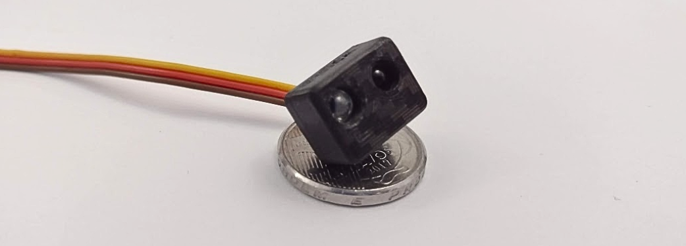
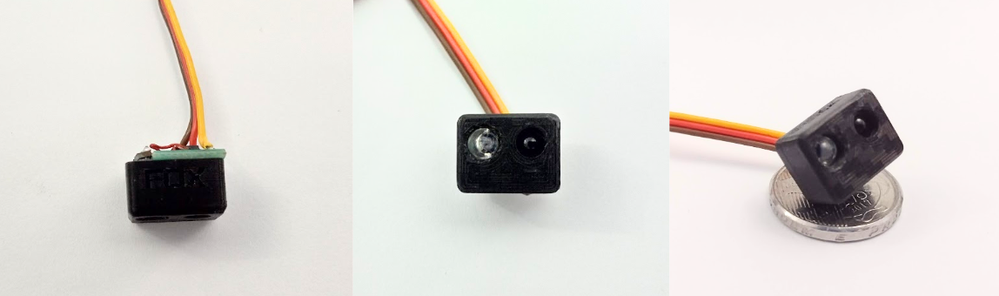

# Sensor Mini Sumô de Opnentes

Sensor digital de oponentes compacto e rápido, projetado especificamente para detectar oponentes em competições de mini ou micro sumô. Além de uma saída digital simples para detecção imediata, ele possui um pino para configuração e leitura que permite a conexão com até 32 sensores usando apenas um único fio, facilitando a integração e o controle em robôs que utilizam muitos sensores.

Além disso, o sensor possui um modo "Shell", que possibilita conectá-lo a um computador através de um conversor USB-Serial. Esse modo permite a leitura de dados e a configuração detalhada dos parâmetros diretamente pelo terminal.



**Video demonstrativo:** ...  

## Características Técnicas

| Característica         | Valor                 |
|------------------------|-----------------------|
| Tipo de sensor         | Obstaculos digital     |
| Faixa de medição       | 5 a 45cm (*)  |
| Tensão de operação     | 3,3 a 5V      |
| Corrente de operação   | 12 a 16mA     |
| Interface de comunicação | saida digital e Pino Fox Wire |
| Dimensões                | 11,4 x 12,4 x 16,2 mm    |
| Peso        | 4,9 g  |

(*) Em testes chegou a alcançar até 70cm na configuração mais sensivel.  
(**) talves tenha suporte a I2C em atualização futura de firmware
<!---| Resolução              | [Resolução]            |-->
<!---| Precisão               | [Precisão]             |-->




## Opções de configuração

[adicionar os outros parametros...]

| Parametros          | Descrição                 |
|---------------------|-----------------------|
| Endereço Fox Wire   | Endereço do dispositivo para o protocoolo Fox Wire     |
| Potencia do Emissor | Potência do emissor, quanto maior maior o alcance. Varia de 10 a 100 |
| Frequência do Emissor | Frequência do emissor, pode ser util para ajustar o alcance ou melhorar o desempenho de sensores proximos (*). valor normalizado de 0 a 255  |
| Trig e Filter_len | ajuste de filtragem do sinal usando um integrador e um "schmitt trigger". Quanto maior a filtragem mais limpo o sinal, porém menor a frequencia de atualização. O usuario pode fazer o ajuste fino para determinar a melhor configuração |
| ... | ... |

(*) Na deteção a longa distância a luz emitida por dois sensore um ao lado do outro a luz emitida por cada um pode causar interferencia destrutiva, reduzindo o alcalce de cada um. Usar frequências um pouco diferentes pode ajudar nisso.

### Modelo 3D

[Modelo 3D STEP](./SensorMini_3dmodel.step)


## Comparação com outros sensores


## Diagrama de Pinagem

- Pino GND
- Pino Vcc (Alimentação de 3,3V a 5V)
- Pino S de saida digital ( HIGH detectado, LOW não detectado )
- Pino Fox Wire (Configuração e leitura)

## Diagrama Esquematimo

### Conexão usando saida digital simples

... adicionar ainda

### Conexão usando Fox Wire

... adicionar ainda


### Conexão usando Fox Wire com Conversor USB Serial

... adicionar ainda


## Exemplo de código usando a saida digital simples

```c++

// Codigo simples usando a saida digital

#define SENSOR_PIN 8

void setup(){
    Serial.begin(115200);
    pinMode(SENSOR_PIN,INPUT);
}

void loop() {
    Serial.print( "Leitura do sensor: " );
    Serial.println( digitalRead(SENSOR_PIN) );
    delay(300);
}
```

---

<p align="center">
  
</p>

<!--- [Alt text](LogoFox.png) -->