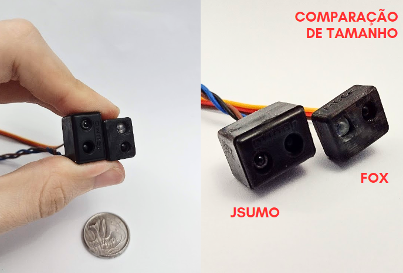

# Sensor Mini Sumô de Opnentes

Este sensor digital de oponentes para robôs de sumô é compacto e rápido, projetado especificamente para detectar oponentes em competições de mini ou micro sumô. Ele oferece uma saída digital simples para detecção imediata e possui uma interface SWIO (Single Wire I/O), que permite a calibração e a comunicação com até 32 sensores usando apenas um único fio, facilitando a integração e o controle em robôs que utilizam muitos sensores.

Além disso, o sensor possui um modo "Shell", que possibilita conectá-lo a um computador através de um conversor USB-Serial. Esse modo permite a leitura de dados e a configuração detalhada dos parâmetros diretamente pelo terminal.


**Video demonstrativo:** ...  

## Características Técnicas

| Característica         | Valor                 |
|------------------------|-----------------------|
| Tipo de sensor         | Obstaculos digital     |
| Faixa de medição       | 5 a 45cm (*)  |
| Tensão de operação     | 3,3 a 5V   |
| Corrente de operação   | 12 a 16mA |
| Interface de comunicação | saida digital e SWIO (**) |
| Dimensões                | 11,4 x 12,4 x 16,2 mm    |
| Peso        | 4,9 g  |

(*) Em testes chegou a alcançar até 70cm na configuração mais sensivel.  
(**) talves tenha suporte a I2C em atualização futura de firmware
<!---| Resolução              | [Resolução]            |-->
<!---| Precisão               | [Precisão]             |-->


## Possiveis atualizações de firmware

- Supote ao protocolo I2C (com endereço configuravel)
- Supote ao protocolo One Wire
- Ajuste de sensibilidade e filtragem

## Comparação com outros sensores



## Diagrama de Pinagem

- Pino GND
- Pino Vcc (Alimentação de 3,3V a 5V)
- Pino S de saida digital ( HIGH detectado, LOW não detectado )
- Pino SWIO

## Diagrama Esquematimo

### Conexão usando saida digital simples

... adicionar ainda

### Conexão usando SWIO

... adicionar ainda

### Conexão usando SWIO com Conversor USB Serial

... adicionar ainda

## Exemplo de código usando a saida digital

```c++

// Codigo simples usando a saida digital

#define SENSOR_PIN 8

void setup(){
    Serial.begin(115200);
    pinMode(SENSOR_PIN,INPUT);
}

void loop() {
    Serial.print( "Leitura do sensor: " );
    Serial.println( digitalRead(SENSOR_PIN) );
    delay(300);
}
```

---

<p align="center">
  
</p>

<!--- [Alt text](LogoFox.png) -->